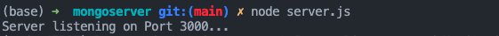
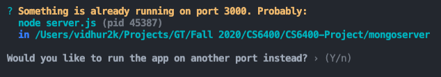
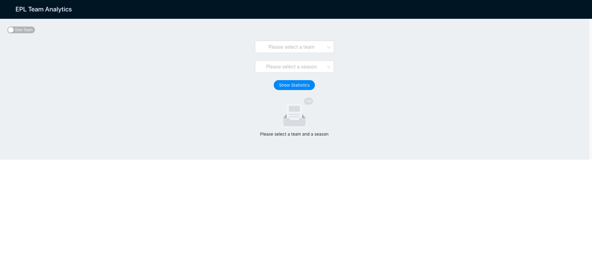
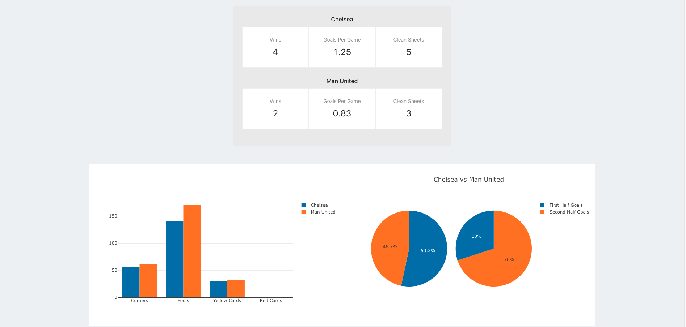

# A Comparison of MongoDB and PostgreSQL for an EPL Team Analytics Application.

## Instructions for Setup

### 1. Data Preparation and Setup
We are using the following database systems:  
**MongoDB**: Version 4.2.11 (Atlas Cluster)  
- Install the MongoDB CLI following [these](https://docs.mongodb.com/mongocli/v1.8/install) instructions.
- Our database is running on an Atlas cluster. We have created a database user for you guys to read from the database.
- Ensure your Mongo Shell is on Version 4.0. Connect to the `eplgames` instance using the following command:
`mongo "mongodb+srv://eplgames.t3whn.mongodb.net/eplgames" --username cs6400staff` (run this on the Mongo shell).
- When prompted for a password, type in `navathe`. You should be able to connect to the instance this way.

**PostgreSQL**: Version 13.1  
- Install the PostgreSQL binary from [this](https://www.postgresql.org/download/) page.
- Run `postgres -V` to ensure that you are on Version 13.1. Next, run `psql` to start your PostgreSQL CLI.
- Next, we create the database tables. Use the following commands on the CLI to create the relations:
    1. `CREATE TABLE referees(id SERIAL PRIMARY KEY, name TEXT NOT NULL)`
    2. `CREATE TABLE teams(id SERIAL PRIMARY KEY, name TEXT NOT NULL)`
    3. `CREATE TABLE games(id SERIAL PRIMARY KEY, home_team int, away_team int,
        )`
- Once we do this, we can upload the data to the PostgreSQL database from the CSVs we have prepared using Pandas.
The data for each relation (including primary keys) is located in the `data/postgres/` subdirectory. Follow 
[this](https://dataschool.com/learn-sql/importing-data-from-csv-in-postgresql/) tutorial on importing data from a CSV
to a Postgres table.
- Now, your database is ready to go! Ensure that it is running when you try to run the API in
the `postgreserver/` directory.
- **NOTE:** Ideally, we would have liked to keep our PostgreSQL instance on the cloud as well, but
none of the offerings' free tiers were ideal for what we wanted to do.

**Data Preprocessing using Pandas**
- A significant amount of time went into the preprocessing stage of the data pipeline due to poor documentation of the data.
- All of the preprocessing is in the `preprocessing.ipynb` notebook. To run it, you need to have **Jupyter** installed.
If you don't have it installed, use [these](https://jupyter.org/install) instructions.
- All third party libraries can be installed using the following commands (which are present in the first cell of the notebook):
   `pip install numpy` and `pip install pandas`. 

**Benchmarking**
- As far as this is concerned, we ran simple read and update latency tests on both databases. The results are
visualized in `experiments.ipynb`. The numbers we passed in there were the result of running a 
particular test 5 times and taking the average result to ensure statistical significance. Run it as it is to see what we found.

### 2. Application and Code
We are using the following programming languages:
1. **Python**: Version 3.7 (for all the Jupyter Notebooks)
2. **NodeJS**: Version 12.19.0 (for Express API development within the `mongoserver/` and `postgreserver` directories.)
3. **Javascript (ES6)**: for ReactJS.

You need to have **npm** installed for running our APIs and **yarn** installed for running the frontend
React application. Use [these](https://www.npmjs.com/get-npm) instructions to install **npm** and
[these](https://classic.yarnpkg.com/en/docs/install/#mac-stable) instructions to install **yarn**. 

Fortunately, the third party libraries we are using for the actual application are all listed in a `package.json`
file in `client/`, `mongoserver/`, and `postgreserver/` directories. In order to install them, simply
cd into the directories and run `npm i -s`.

##### Running the Servers
- Keep in mind that *you are only supposed to run one server at a time*. Also, ensure that you have completed the setup
in the **Data Preparation and Setup** section. 
- In order to run the server, simply cd into the corresponding directory and run `node server.js`. You will see the following
response on the CLI:

### Running the Client
- The client is a React application and we use **yarn** as a package manager for it.
- Start one of the servers. They will run on port 3000.
- In order to run it, simply cd into `client/` and run `yarn` followed by `yarn start`. You will see the following prompt:

Type **y** into the console and it'll start the application for you on a **localhost** window. The port doesn't
matter in this case.
- You have a running application now! Have fun viewing different teams' stats (Man United is very attractive take a look.)

### Code Documentation and References
- We have not used anyone else's code in this project. It is entirely our work. All files (except for 
`node_modules` and some boilerplate React code) were written by us as well.
- Running the client should land you on this page:

This is the one team page view. The toggle on the top left is used to switch between one and two team views.
- Here is an example of the results displayed for Chelsea and Manchester United:

